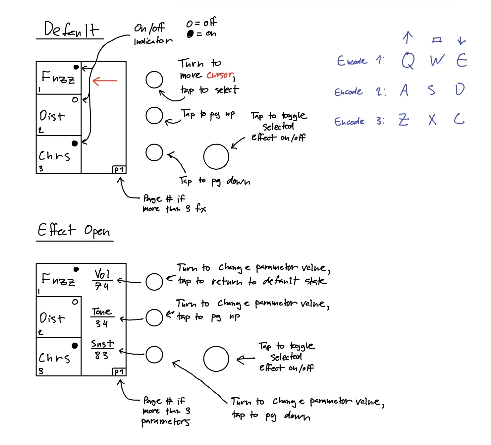

# Controls

Documentation for controlling the GUI through the knobs and footswitches.

This diagram will likely become less accurate as the GUI is changed

## Color Coding

Red knob corresponds to the top encoder. Green corresponds to the middle. Blue
corresponds to the bottom.

## Keyboard Controls

| | Turn Left | Click In | Turn Right |
|:-:|:---------:|:--------:|:----------:|
|Top (red) encoder|q|w|e|
|Middle (green) encoder|a|s|d|
|Bottom (blue) encoder|z|x|c|
